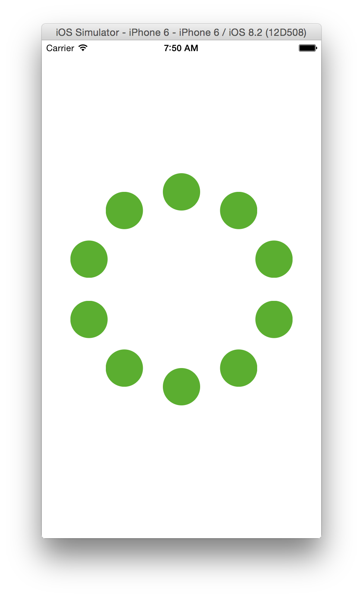
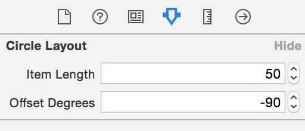
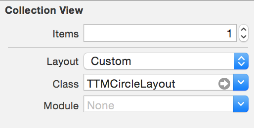

# misc

##TTMCircleLayout

Circular layout class for UICollectionView.

Modified from Apple's "CircleLayout" class which is included in WWDC 2012 example.

###Features

- Adaptive to the size of the collection view.
- Customizable in IB.

###How to use

Just set in IB as the Custom Layout Class.

##TTMCountingLabel

- Modified from [UICountingLabel](https://github.com/dataxpress/UICountingLabel)
- Enabled to customize `easingRate` property.

